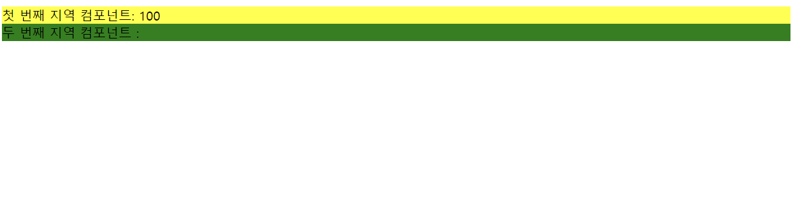
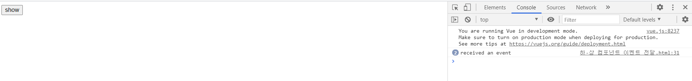
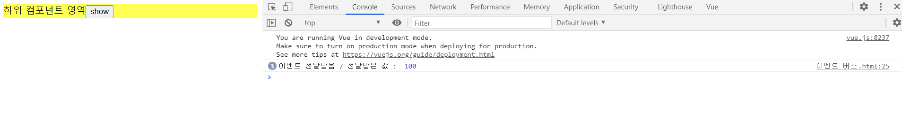

# 뷰 컴포넌트 통신

## 지역 컴포넌트 유효 범위.html



num2에 출력X
* 이유 : (둘 다 지역 컴포넌트) my-component2에서 my-component1의 값을 직접 참조할 수 없다!

<hr>
<br>

## 상-하 컴포넌트 데이터 전달.html


hello vue! passed from parent Component 출력됨


* child-compo를 전역 컴포넌트로 등록한 것 이외에 딱히 상위 컴포넌트를 지정하지 않았지만, 뷰 인스턴스 안에 마치 상위 컴포넌트가 존재하는 것처럼 하위 컴포넌트로 props를 내려보냄

* 컴포넌트를 등록함과 동시에 뷰 인스턴스 = 상위 컴포넌트가 됨

<br>
<정리>

인스턴스에 새로운 컴포넌트 등록

* 기존 컴포넌트는 상위(parent) 컴포넌트가 됨
* 새로 등록된 컴포넌트는 하위(child)컴포넌트가 됨
* 인스턴스 : 최상위 컴포넌트 (Root Component) 

<hr>
<br>

## 하-상 컴포넌트 이벤트 전달.html

데이터 전달 : 상 - 하 단방향 데이터 흐름에 어긋남

-> 이벤트를 발생시켜(event emit) 상위 컴포넌트에 신호를 보낸다

-> 상위 컴포넌트에서 이벤트를 수신하여 상위 컴포넌트의 메서드 호출

```
this.$emit('이벤트명');
```
이벤트 발생

여기서 this는 하위 컴포넌트를 가리킴

```
<child-component v-on:이벤트명="상위 컴포넌트 메서드명"></child-component>
```
이벤트 수신

<br>




show 버튼 클릭하면 received an event 가 콘솔창에 뜸 (몇 번 눌렀는지도 뜸)

<hr><br>

## 같은 레벨의 컴포넌트 간 통신

하나의 공통 상위 컴포넌트 & 두개의 하위 컴포넌트가 있을 때(A,B)

뷰는 상 -> 하로만 데이터를 전달해야 함!

하위A -> 하위B로 전달하려면 

하위A (event)-> 상위 (props)-> 하위B로 전달해야함

<hr>
<br>

## 관계 없는 컴포넌트 간 통신 - 이벤트 버스

상-하 관계가 아니더라도 데이터를 전달 가능

```
var eventBus=new Vue();
```
이벤트 버스를 위한 추가 인스턴스 1개 생성

<br>

```
methods{
    메서드명 : function(){
        eventBus.$emit('이벤트명',데이터);
    }
}
```
이벤트를 보내는 컴포넌트
$emit()

<br>

```
methods:{
    created: function(){
        eventBus.$on('이벤트명',funciton(데이터)){
            내용
        });
    }
}
```
이벤트를 받는 컴포넌트
$on()

<br>





<br><Br>

(컴포넌트가 많아져서 관리가 안 되면 Vuex (상태 관리 도구) 필요)