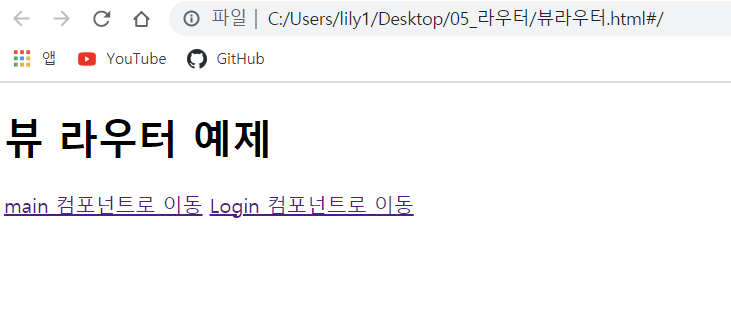

# 뷰 라우터

라우팅 : 웹 페이지 간의 이동 방법

(SPA : Single Page Application에서 주로 사용)

(spa : 페이지를 이동할 때마다 서버에 웹 페이지를 요청하여 새로 갱신하는 것이 아니라 

미리 해당 페이지들을 받아 놓고 페이지 이동 시에 클라이언트의 라우팅을 이용하여 화면을 갱신하는 패턴을 적용한 애플리케이션)

장점 : 화면 간의 전환이 매끄럽다. 더 빠르게 화면을 조작할 수 있어 사용자 경험 향상

<br>

## 뷰 라우터 : 뷰에서 라우팅 기능을 구현할 수 있도록 지원하는 공식 라이브러리

```
<router-link to="URL값" >
```
페이지 이동 태그

화면에서는 < a>로 표시되고, 클릭하면 URL로 이동

```
<router-view>
```
페이지 표시 태그

변경되는 URL에 따라 해당 컴포넌트를 뿌려주는 영역


[연습이미지]

기본화면

main 컴포넌트로이동 클릭 시

Login 컴포넌트로 이동 클릭 시


<br>
위 연습 예제) 한 화면에 컴포넌트 하나만 표시하기 
<br>

***

<br>

## 네스티드 라우터

라우터로 페이지를 이동할 때 __최소 2개 이상의 컴포넌트를__ 화면에 나타낼 수 있다

(컴포넌트 속 컴포넌트..)

상위 컴포넌트가 하위 컴포넌트를 포함한다


주소 확인하기!

./users

./users/posts

./users/profile

Userpost 안에 post와 profile 있음

네스티드 라우터의 단점) 화면을 구성하는 컴포넌트의 수가 적을 때는 유용하지만 한 번에 더 많은 컴포넌트를 표시하는 데는 한계가 있음


***
<br>

## 네임드 뷰

특정 페이지로 이동했을 때 __여러 개의 컴포넌트를 동시에 표시하는 라우팅 방식__

