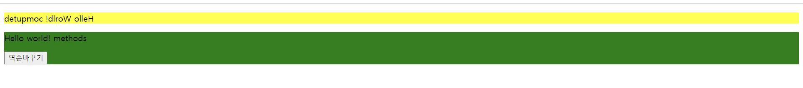

# 뷰 템플릿

방법1) 
```
template: '<p>hello {{message}}</p>
```

방법2) 
```
<template> <p> hello {{message}}</p></template>
```
***

## 데이터 바인딩

* {{}}

{{message}} 에서 message:값이 바뀌면 화면 갱신됨

 but, < div id="app" v-once>를 쓰면 안바뀜

* v-bind

id,class,style 등의 html 속성값에 뷰 데이터 값을 연결할 때 사용

```
<div id="abc">
    <p v-bind:id="idid">id 바인딩</p>
    <p v-bind:class="clcl">class 바인딩</p>
    <p v-bind:style="stst">style 바인딩</p>
</div>

<script>
    new Vue({
        el:'#abc',
        data:{
            idid:100,
            clcl:'container'
            stst:'color:yellow'
        }
    });
</script>
```
***

## 자바스크립트 표현식

```
<div id="abc">
    <p>{{message}}</p>
    <p>{{message+"!!!"}}</p>
    <p>{{message.split('').reverse().join('')}}</p>
    <!--세번째 : 거꾸로 바꿔 출력-->
</div>
```
* var a=10; 이런거 안됨
* {} 못 씀
* 간단한 연산 결과만 표시!

***

## 디렉티브


* v-if : True/False에 따라 화면 표시 여부(false면태그를 삭제)< a v-if="flag">hello</ a>
* v-for : 반복문 < li v-for="system in systems">{{system}}</il>
* v-show : 화면에 표시 여부(false면 삭제까지는 아니고 display:none)
* v-bind : HTML태그의 기본 속성과 뷰 데이터 속성을 연결
* v-on : 이벤트를 감지하여 처리 v-on:click
* v-model : 폼에 입력한 값을 뷰 인스턴스의 데이터와 즉시 동기화

flag:true일때


<br>

flag:false일때

display:none확인(v-if와 v-show차이점)


***

## 이벤트 처리

* v-on 디렉티브 활용
* methods 속성 활용


***

## 고급 템플릿 기법

* computed 속성
    * 장점1) data속성 값의 변화에 따라 자동으로 다시 연산
    * 장점2) 캐싱(동일한 연산을 반복X, 연산의 결과 값을 미리 저장&불러오기)



computed vs methods

computed가 더 효율적

methods는 버튼을 클릭해야 바뀐다

<br><br>

* watch 속성

    * 데이터 변화를 감지하여 자동으로 특정 로직 수행

    * computed속성은 내장 API를 활용한 간단한 연산에 적합

    * watch속성은 데이터 호출 등 시간이 상대적으로 더 많이 소모되는 비동기 처리에 적합

