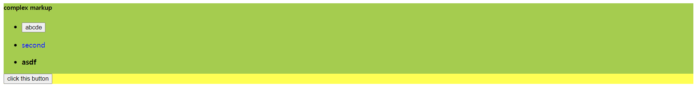

## 싱글 파일 컴포넌트 체계

HTML 파일에서 뷰 코드 작성 시 한계점) 복잡, 알아보기 쉽지 않다

싱글 파일 컴포넌트) 구조 파악하기에 더 좋다

***

HTML 파일에서 뷰 코드 작성 예제

***

## 뷰 CLI

싱글 파일 컴포넌트 체계를 사용) .vue 파일을 웹 브라우저가 인식할 수 있는 형태의 파일로 변환해 주는 Webpack이나 Browserify 필요

->뷰 개발자들이 편하게 프로젝트를 구성할 수 있도록 CLI(Command Line Interface) 도구 제공

뷰 CLI 설치) cmd) npm install vue-cli -global

명령어

* vue init webpack : 고급 웹펙 기능을 활용한 프로젝트 구성 방식, 테스팅, 문법 검사 등 지원
* vue init webpack-simple : 웹펙 최소 기능을 활용한 프로젝트 구성 방식. 빠른 화면 프로토타이핑용
* vue init browserify : 고급 브라우저리파이 기능을 활용한 프로젝트 구성 방식. 테스팅, 문법 검사 등 지원
* vue init browserify-simple : 브라우저리파이 최소 기능을 활용한 프로젝트 구성 방식. 빠른 화면 프로토타이핑용
* vue init simple : 최소 뷰 기능만 들어간 HTML 1개 생성
* vue init pwa : 웹펙 기반의 PWA(Progressive web App) 기능을 지원한흔 뷰 프로젝트

1. 뷰 프로젝트용 빈 폴더 생성
2. cmd) vue init webpack-simple
3. 현재 디렉토리에 프로젝트 생성 여부 / 프로젝트 이름 / 설명 / 제작자 / 라이선스 / sass사용여부 입력
4. cmd) npm install : 관련 라이브러리 다운, 폴더 구조 생성
    * node_modules 폴더 : npm install 명령어로 다운받은 라이브러리가 존재하는 위치
    * src 폴더 : .vue 파일을 비롯하여 애플리케이션이 동작하는 데 필요한 로직이 들어갈 위치
    * index.html : 뷰로 만든 웹 앱의 시작점. npm run dev 실행 시 로딩되는 파일
    * package.json : npm 설정 파일. 뷰 애플리케이셔닝 동작하는 데 필요한 라이브러리 정의
    * webpack.config.js : 웹팩 설정 파일. 웹팩 빌드를 위해 필요한 로직들을 정의
5. cmd) npm run dev (src/App.vue 파일이 웹 페이지에 표시)

