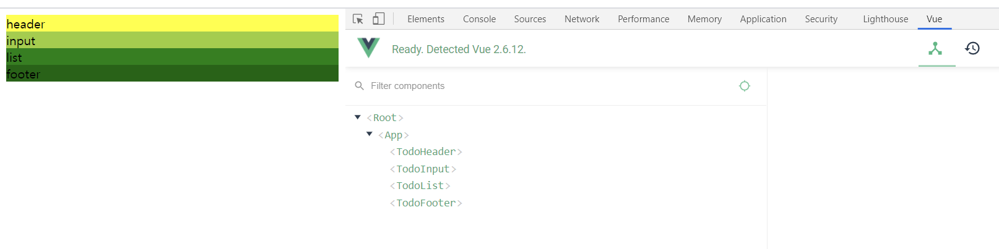
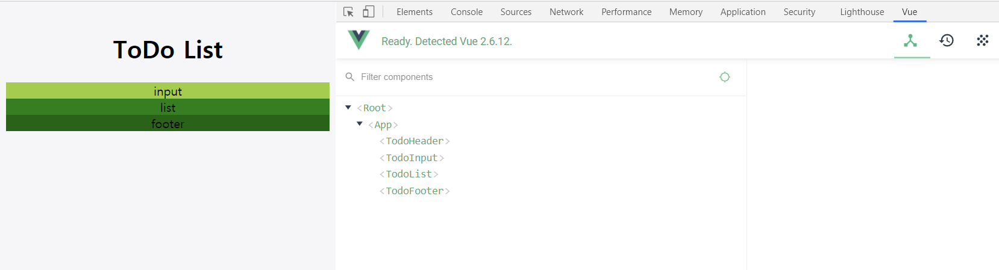
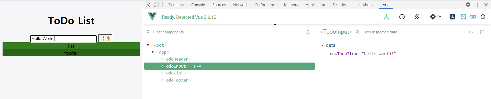
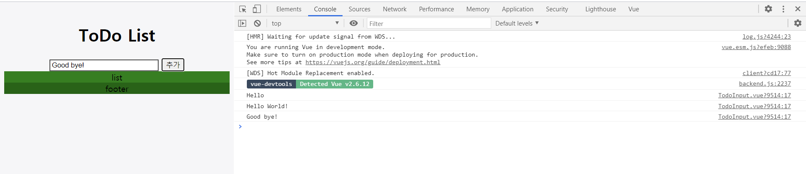
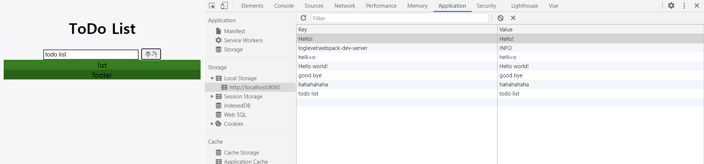
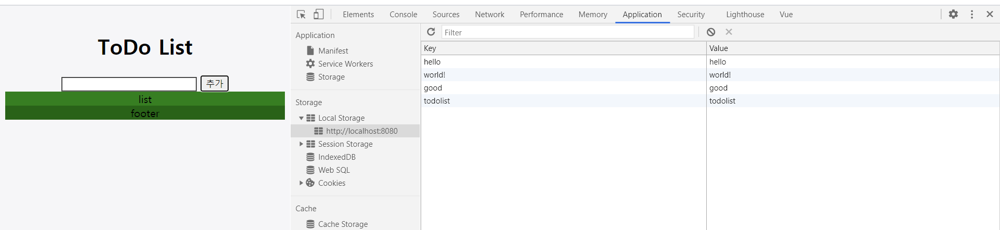
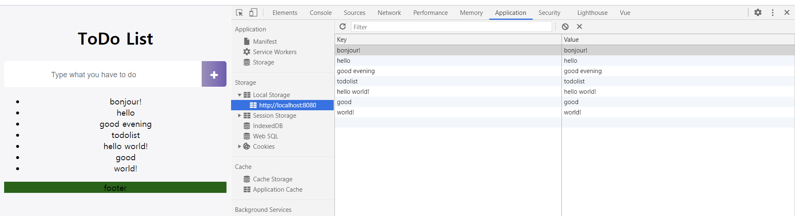
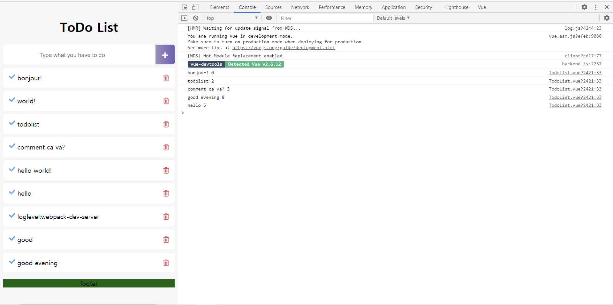
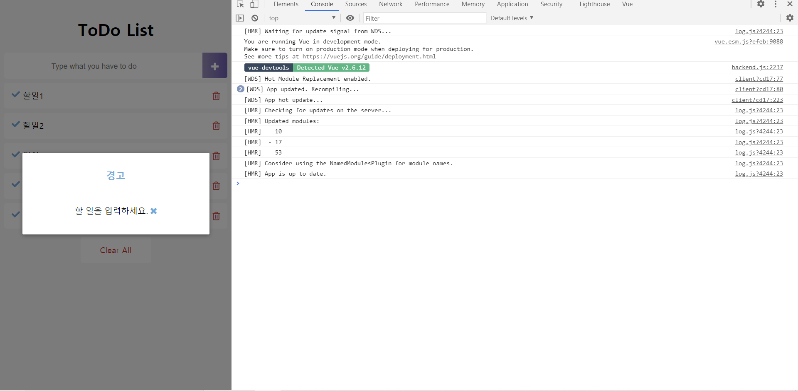

# .vue파일 지역 컴포넌트 등록하기

App.vue 파일 수정-컴포넌트 내용 불러오기
```
<template>
  <div id="app">
    <TodoHeader></TodoHeader>
    <TodoInput></TodoInput>
    <TodoList></TodoList>
    <TodoFooter></TodoFooter>
  </div>
</template>

<script>
import TodoHeader from './components/TodoHeader.vue'
import TodoInput from './components/TodoInput.vue'
import TodoList from './components/TodoList.vue'
import TodoFooter from './components/TodoFooter.vue'

export default {

  components: {
    'TodoHeader': TodoHeader,
    'TodoInput': TodoInput,
    'TodoList': TodoList,
    'TodoFooter': TodoFooter
  }
}
</script>

<style>

</style>
```


컴포넌트 내용 불러오기 성공

<br><br>


TodoHeader작성(제목)

<br><br>


글씨 입력하는대로 바로 갱신됨

<br><br>


console로 버튼 작동 확인

<br><br>


추가 버튼 누르면 저장 확인

localStorage라서 새로고침 해도 안 없어지고 그대로 있다!

링크에 다시 들어가도 안 없어짐

```
methods: {
    addTodo(){
        localStorage.setItem(this.newTodoItem,this.newTodoItem);
    }
}
```

<br><br>


if문 이용 - 만약 글씨가 비어있지 않으면 저장

추가 버튼 누르면 입력창 비워진다

<br><br>


v-for 이용해서 li반복

li 안에 v-for넣었을 때 v-bind key 어쩌고 에러 뜨는데 v-bind:key="todoItem" 추가해서 해결

단점) 목록 추가했을 때 새로고침 안하면 추가안됨

<br><br>


쓰레기통 아이콘 클릭 시 콘솔 창에 내용&인덱스 출력

<br><br>


모달창